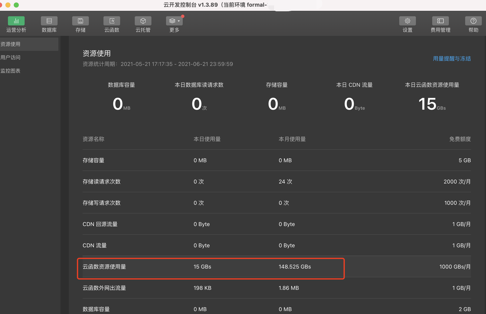

# README

## 1 作品简介

实际项目中，有非常多的需要使用到流程审批的地方，比如申请一个单子，需要相关责任人的审核再进入下一步。为了提高研发效率与流程审批的便捷性，我们设计了一个小型的流程审批引擎——蚂蚁。蚂蚁审批引擎目前<u>承载平台所需的流程接入功能，如能力的上下线审批流程、托管能力实例扩容审批流程、能力使用方申请使用能力审批流程、业务流程审批等。</u>支持 PC 端和移动端的使用，**移动端通过小程序基于 Cloud Base 云开发来实现**，也就是本文提交的作品。

对于流程当前处理人，可以通过小程序进行流程审批、驳回和查看，对于流程发起者，可以通过小程序查看流程的进度和状态。

自 5 月 21 日正式上线以来，用户数据如下：

​ 

Cloud Base 云开发资源使用情况如下：

​ 

## 2 封面图
​ 

## 3 云开发能力应用情况

**数据流：** 用户从 Web 发起流程，后台通过企业微信应用向发起者与负责人推送的小程序提醒，接收者从移动端企业微信应用点击后拉起小程序。如果负责人在小程序内操作审批逻辑，交给 Cloud Base 云函数处理。

**小程序：** 主要负责蚂蚁流程在<u>移动端</u>的查看列表/查看详情/通过/驳回<u>操作</u>，基于 **WeUI** 实现。

**Cloud Base 云开发：** 主要负责小程序的<u>后台逻辑</u>：查看列表/查看详情/通过/驳回操作。

## 4 功能模块介绍

### 4.1 云函数

​ 

各函数的功能描述如下表所示：

| **函数名**       | **功能**                                                                                                                                                                                                                                                                                                                    |
| ---------------- | --------------------------------------------------------------------------------------------------------------------------------------------------------------------------------------------------------------------------------------------------------------------------------------------------------------------------- |
| getAntProcess    | 根据流程 ID 获取流程详情                                                                                                                                                                                                                                                                                                    |
| getAntProcesses  | 获取所有流程详情                                                                                                                                                                                                                                                                                                            |
| passAntProcess   | 审批通过一个流程                                                                                                                                                                                                                                                                                                            |
| rejectAntProcess | 驳回一个流程                                                                                                                                                                                                                                                                                                                |

### 4.2 小程序

蚂蚁引擎小程序，为流程操作提供了移动端的支持。主要分为 5 个 pages：

​ 

主要分为 index/done/detail/outsider/404 共 5 个页面，各页面页的交互流程如下图所示：

​ 

各页面的功能描述如下表所示：

| **页面** | **功能**                                                                                      |
| -------- | --------------------------------------------------------------------------------------------- |
| index    | 小程序主页，提供用户的流程指标统计，与待处理流程列表                                          |
| done     | 提供已处理的历史列表                                                                          |
| detail   | 提供单个流程的信息展示与操作                                                                  |
| outsider | 重定向司外用户到此页面                                                                        |
| 404      | 通过第三方（如企业微信应用/企业微信机器人）拉起的流程详情，如果流程 ID 不存在，重定向到此页面 |

## 5 体验二维码

​ 

## 6 源码链接

https://github.com/WeDaHub/incubator-ant

## 7 贡献者

| Github ID |
| :-------: |
| jchalex |
| philhuan |
| haobiaosheng |
